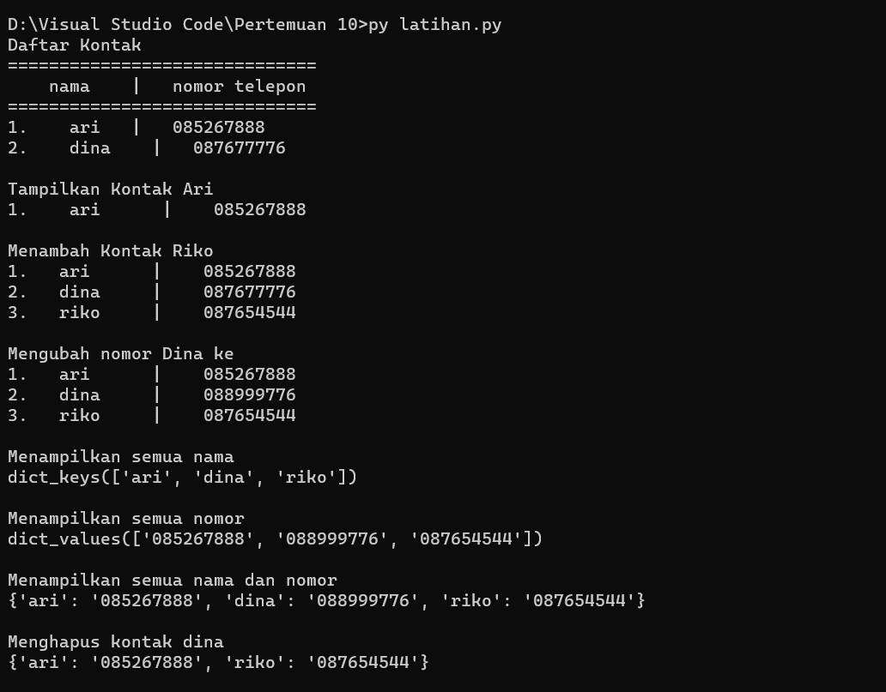
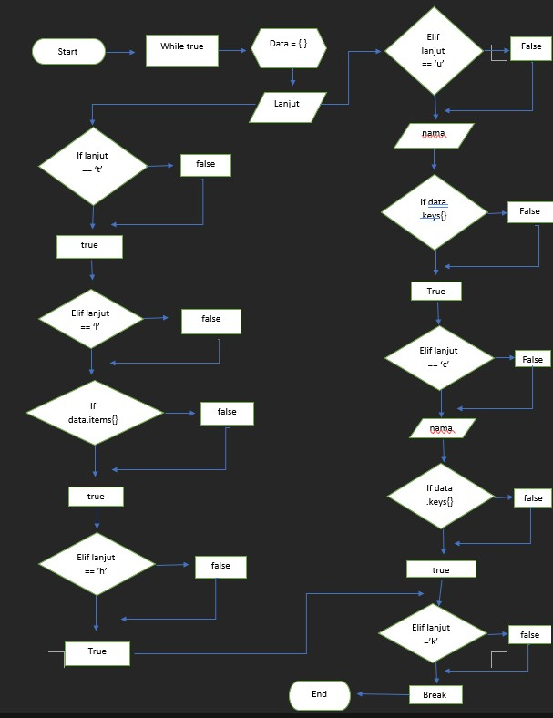
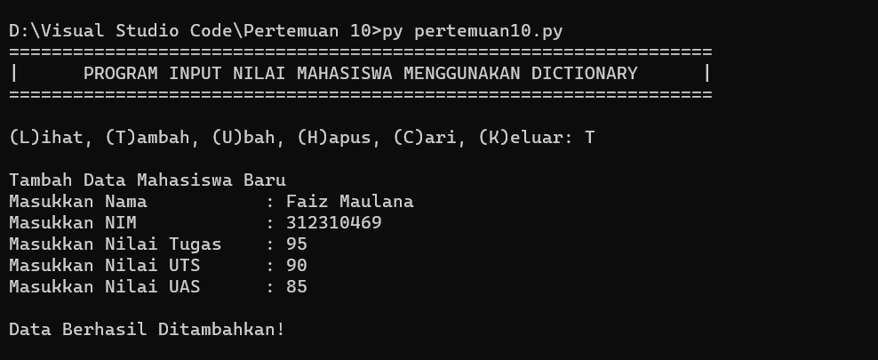

# PERTEMUAN 10

| Variable | Isi |
| -------- | --- |
| **Nama** | Carlos Louis Fernando  |
| **NIM** | 312310458 |
| **Kelas** | TI.23.A5 |
| **Mata Kuliah** | Bahasa Pemrograman |

# Latihan
* membuat kontak awal / ```b = {'ari' : '085267888', 'dina' : 087677776}```
* menampilkan kontak ari /  ```print(b['ari'])```
* menambhkan kontak riko /  ```b['riko']= 087888999```
* mengubah kontak dina / ```b['dina]= '089555777```
* menampilkan semua nama / ```print(b.keys())```
* menampilkan semua nomor / ```print(b.values())```
* menampilkan semua nama dan nomor / ```print(b)```
* menghapus kontak dina / ```del b['dina']```

## Berikut adalah codingan programnya
```python


b={'ari':'085267888','dina':'087677776'}
print('Daftar Kontak')
print('==============================')
print('    nama    |   nomor telepon')
print('==============================')
print('1.    ari   |   085267888','\n2.    dina    |   087677776')

# tamprintilkan kontak ari
print('\nTampilkan Kontak Ari')
print('1.    ari      |   ',b['ari'])
# Tambahkan riko ke kontak
print('\nMenambah Kontak Riko')
b['riko']='087654544'
print('1.   ari      |   ',b['ari'])
print('2.   dina     |   ',b['dina'])
print('3.   riko     |   ',b['riko'])
# Ubah Nomor dina ke nomor baru 
print('\nMengubah nomor Dina ke')
b['dina']='088999776'
print('1.   ari      |   ',b['ari'])
print('2.   dina     |   ',b['dina'])
print('3.   riko     |   ',b['riko'])
# Tampilkan semua nama
print('\nMenampilkan semua nama')
print(b.keys())
# Tampilkan semua nomor
print('\nMenampilkan semua nomor')
print(b.values())
# Tampilkan semua nama dan nomor
print('\nMenampilkan semua nama dan nomor')
print(b)
# Hapus kontak dina
print('\nMenghapus kontak dina')
del b['dina']
print(b,'\n')
```

## Berikut adalah hasil perogramnya


# Tugas Praktikum
_program sederhana yang akan menampilkan daftar nilai mahasiswa_
## Flowchart

1. membuat lopping agar program terus berjalan:
```python
sh while True :
    c = input("\n(L)ihat, (T)ambah,(U)bah, (C)ari, (K)eluar): ")
```
2. membuat formatif if untuk memasukan pilihan , contoh pilihan (t): \
```python
if (c.lower() == 't'):                                               
     print('\nTambah Data Mahasiswa Baru')
        nama= input("Masukkan Nama\t\t: ")                                        
        nim= input("Masukkan NIM\t\t: ")                                         
        nilaiTugas= int(input("Masukkan Nilai Tugas\t: "))                              
        nilaiUts= int(input("Masukkan Nilai UTS\t: "))                                   
        nilaiUas= int(input("Masukkan Nilai UAS\t: "))                                    
        nilaiAkhir= (0.30 * nilaiTugas) + (0.35 * nilaiUts) + (0.35 * nilaiUas)              
        dataMhs[nama]= nim, nilaiTugas, nilaiUts, nilaiUas, nilaiAkhir                         
        print("\nData Berhasil Ditambahkan!")
```

3. membuat percabangan elif untuk menjalankan pilihan yang lain
```python
elif (c.lower() == 'u'):                                                                    
        print('\nMengedit Data Mahasiswa')
        nama = input("Masukkan Nama: ")                                                         
        if nama in dataMhs.keys():                              
            nim= input("Masukkan NIM Baru\t: ")                              
            nilaiTugas= int(input("Masukkan Nilai Tugas\t: "))                           
            nilaiUts= int(input("Masukkan Nilai UTS\t: "))                           
            nilaiUas= int(input("Masukkan Nilai UAS\t: "))                           
            nilaiAkhir= (0.30 * nilaiTugas) + (0.35 * nilaiUts) + (0.35 * nilaiUas)          
            dataMhs[nama] = nim, nilaiTugas, nilaiUts, nilaiUas, nilaiAkhir                      
            print("\nData Berhasil Di Update!")
```
4. menggunakan else apabila salah memasukan pilihan 
```python
else:
        print("Pilih menu yang tersedia: ")
```
## Output untuk (T) :

## Output untuk (U) :

## Output untuk (L) :

## Output untuk (C) :

## Output untuk (H) :


# Terima Kasih
